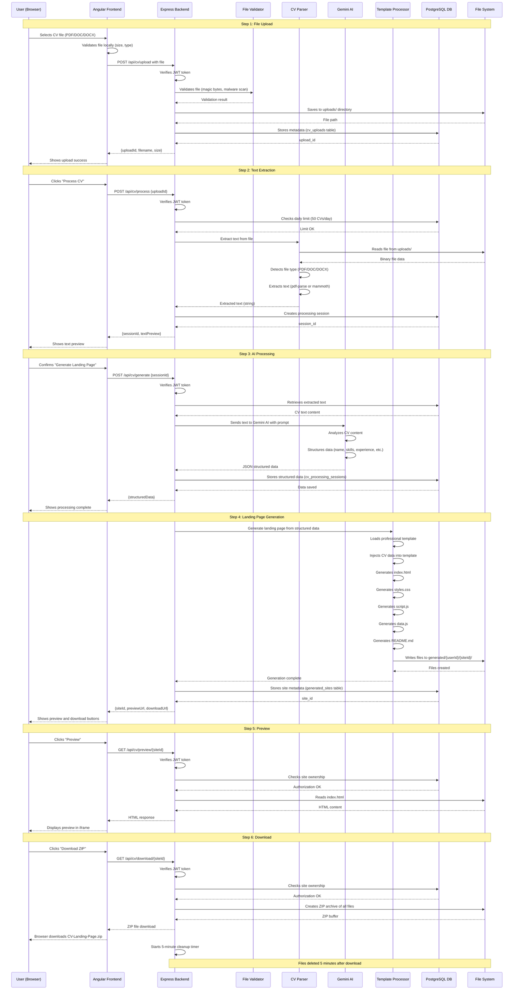

# CV Processing Data Flow

**Navigation**: [Documentation Home](../README.md) > [Diagrams](architecture-overview.md) > CV Processing Flow

**Last Updated**: December 26, 2025

---

## Overview

This document explains the complete data flow from when a user uploads their CV file to when they download their generated landing page. Every step is explained with code references and data transformations.

---

## Visual Data Flow



---

## Step-by-Step Breakdown

### Step 1: File Upload

**User Action**: User selects a CV file (PDF, DOC, or DOCX) and clicks "Upload"

**Frontend Processing**:
- Location: [`frontend/src/app/pages/upload/upload.component.ts:50-80`](../../frontend/src/app/pages/upload/upload.component.ts)
- Validates file size (max 10MB)
- Validates file type (PDF, DOC, DOCX only)
- Creates FormData with file
- Sends POST request to `/api/cv/upload`

**Backend Processing**:
- **Route**: [`server/routes/cv.js:20-50`](../../server/routes/cv.js)
- **Authentication**: JWT token verified by `verifyTokenEnhanced` middleware
- **Rate limiting**: Per-user limit checked (50 CV operations per 15 minutes)
- **File validation**: [`server/middleware/file-validation.js`](../../server/middleware/file-validation.js)
  - Magic bytes check (actual file type vs extension)
  - Malware pattern detection (scripts, executables, eval patterns)
  - MIME type validation
- **File storage**: Multer saves file to `server/uploads/{randomFilename}`
- **Database**: Metadata inserted into `cv_uploads` table

**Database Changes**:
```sql
INSERT INTO cv_uploads (user_id, filename, original_filename, file_size, mime_type, file_hash, upload_date)
VALUES ($1, $2, $3, $4, $5, $6, NOW())
RETURNING upload_id;
```

**Response to Frontend**:
```json
{
  "uploadId": "uuid-v4-string",
  "filename": "original_cv_name.pdf",
  "size": 1024567,
  "message": "File uploaded successfully"
}
```

**What's stored where**:
- **File system**: CV file in `server/uploads/abc123.pdf`
- **Database**: Metadata in `cv_uploads` table (filename, user_id, size, timestamp)

---

### Step 2: Text Extraction

**User Action**: User clicks "Process CV" button after upload

**Frontend Processing**:
- Location: [`frontend/src/app/pages/upload/upload.component.ts:100-130`](../../frontend/src/app/pages/upload/upload.component.ts)
- Sends POST request to `/api/cv/process` with `{uploadId}`

**Backend Processing**:
- **Route**: [`server/routes/cv.js:80-150`](../../server/routes/cv.js)
- **Authentication**: JWT token verified
- **Daily limit check**: Queries `cv_processing_sessions` table to count user's CVs processed today
  - Free tier limit: 50 CVs per day per user
  - Returns 429 error if limit exceeded
- **CV Parser**: [`server/lib/cv-parser-modular.js:20-100`](../../server/lib/cv-parser-modular.js)
  - Detects file type from magic bytes
  - **PDF**: Uses `pdf-parse` library to extract text
  - **DOC/DOCX**: Uses `mammoth` library to extract text
  - Returns plain text string

**Text Extraction Implementation**:
```javascript
// For PDF files
const dataBuffer = fs.readFileSync(filePath);
const pdfData = await pdfParse(dataBuffer);
const extractedText = pdfData.text;

// For DOCX files
const result = await mammoth.extractRawText({path: filePath});
const extractedText = result.value;
```

**Database Changes**:
```sql
INSERT INTO cv_processing_sessions (user_id, upload_id, extracted_text, status, session_date)
VALUES ($1, $2, $3, 'extracted', NOW())
RETURNING session_id;
```

**Response to Frontend**:
```json
{
  "sessionId": "uuid-v4-string",
  "textPreview": "First 500 characters of extracted text...",
  "wordCount": 1234,
  "status": "extracted"
}
```

**What's stored where**:
- **Database**: Extracted text in `cv_processing_sessions.extracted_text` (PostgreSQL)
- **File system**: Original file remains in `server/uploads/`

---

### Step 3: AI Processing (Gemini)

**User Action**: User reviews text preview and clicks "Generate Landing Page"

**Frontend Processing**:
- Location: [`frontend/src/app/pages/upload/upload.component.ts:150-180`](../../frontend/src/app/pages/upload/upload.component.ts)
- Sends POST request to `/api/cv/generate` with `{sessionId}`

**Backend Processing**:
- **Route**: [`server/routes/cv.js:180-250`](../../server/routes/cv.js)
- **Authentication**: JWT token verified
- **Session retrieval**: Fetches extracted text from `cv_processing_sessions` table
- **LLM Client**: [`server/lib/utils/llm-client-factory.js`](../../server/lib/utils/llm-client-factory.js)
  - Creates Gemini AI client (or Ollama if configured)
  - Sends structured prompt with CV text

**Gemini AI Prompt**:
```
You are a CV parsing expert. Extract structured information from this CV:

{extracted_text}

Return ONLY valid JSON with this exact structure:
{
  "personalInfo": {
    "name": "Full Name",
    "email": "email@example.com",
    "phone": "+1234567890",
    "location": "City, Country",
    "title": "Professional Title",
    "summary": "Professional summary..."
  },
  "skills": [
    {"name": "Skill 1", "level": "Expert"},
    {"name": "Skill 2", "level": "Intermediate"}
  ],
  "experience": [
    {
      "company": "Company Name",
      "position": "Job Title",
      "startDate": "2020-01",
      "endDate": "2023-12",
      "current": false,
      "description": "Responsibilities and achievements...",
      "achievements": ["Achievement 1", "Achievement 2"]
    }
  ],
  "education": [...],
  "certifications": [...],
  "languages": [...],
  "projects": [...]
}
```

**AI Processing**:
- **Model**: `gemini-pro` (or configured Ollama model)
- **Temperature**: 0.1 (low creativity, high accuracy)
- **Max tokens**: Configured in environment
- **Parsing**: AI analyzes CV text and structures it into JSON

**Database Changes**:
```sql
UPDATE cv_processing_sessions
SET structured_data = $1,
    status = 'processed',
    processing_completed_at = NOW()
WHERE session_id = $2;
```

**Response to Frontend**:
```json
{
  "sessionId": "uuid-v4-string",
  "structuredData": {
    "personalInfo": {...},
    "skills": [...],
    "experience": [...],
    "education": [...],
    "certifications": [...],
    "languages": [...],
    "projects": [...]
  },
  "status": "processed"
}
```

**What's stored where**:
- **Database**: Structured JSON in `cv_processing_sessions.structured_data`
- **Third-party**: CV text was sent to Gemini AI (per Google's privacy policy)

---

### Step 4: Landing Page Generation

**Automatic Process**: Happens immediately after AI processing completes

**Backend Processing**:
- **Template Processor**: [`server/lib/template-processor.js:50-300`](../../server/lib/template-processor.js)
- **Template source**: `server/templates/professional/` directory
- **Output directory**: `server/generated/{userId}/{siteId}/`

**Files Generated**:

1. **index.html** - Main landing page structure
   - Injects personal info into HTML template
   - Adds sections: About, Skills, Experience, Education, Projects, Contact
   - Responsive design with mobile navigation

2. **styles.css** - Styling and layout
   - Professional color scheme
   - Responsive grid layout
   - Animation definitions
   - Print styles

3. **script.js** - Interactivity
   - Smooth scrolling
   - Active nav highlighting
   - Mobile menu toggle
   - Contact form validation
   - Animations on scroll

4. **data.js** - Structured CV data
   - All CV data as JavaScript object
   - Used by script.js for dynamic content
   - Allows easy customization

5. **README.md** - Deployment instructions
   - How to deploy to GitHub Pages
   - How to deploy to Vercel/Netlify
   - How to customize the site

**File Creation Process**:
```javascript
// Create output directory
const outputDir = path.join(__dirname, '../generated', userId, siteId);
fs.mkdirSync(outputDir, { recursive: true });

// Load template
const templatePath = path.join(__dirname, '../templates/professional');
const htmlTemplate = fs.readFileSync(path.join(templatePath, 'index.html'), 'utf8');

// Inject data
const personalInfo = structuredData.personalInfo;
let html = htmlTemplate
    .replace('{{NAME}}', personalInfo.name)
    .replace('{{TITLE}}', personalInfo.title)
    .replace('{{EMAIL}}', personalInfo.email)
    // ... more replacements

// Write file
fs.writeFileSync(path.join(outputDir, 'index.html'), html);
```

**Database Changes**:
```sql
INSERT INTO generated_sites (user_id, session_id, site_name, file_path, created_at)
VALUES ($1, $2, $3, $4, NOW())
RETURNING site_id;
```

**Response to Frontend**:
```json
{
  "siteId": "uuid-v4-string",
  "previewUrl": "/api/cv/preview/uuid-v4-string",
  "downloadUrl": "/api/cv/download/uuid-v4-string",
  "filesGenerated": 5,
  "message": "Landing page generated successfully"
}
```

**What's stored where**:
- **File system**: 5 files in `server/generated/{userId}/{siteId}/` directory
- **Database**: Site metadata in `generated_sites` table

---

### Step 5: Preview

**User Action**: User clicks "Preview" button to see their landing page

**Frontend Processing**:
- Location: [`frontend/src/app/pages/dashboard/dashboard.component.ts:100-120`](../../frontend/src/app/pages/dashboard/dashboard.component.ts)
- Opens preview modal with iframe
- Iframe src: `/api/cv/preview/{siteId}`

**Backend Processing**:
- **Route**: [`server/routes/cv.js:300-350`](../../server/routes/cv.js)
- **Authentication**: JWT token verified
- **Authorization**: Verifies user owns this site (checks `generated_sites.user_id`)
- **File reading**: Reads `index.html` from `generated/{userId}/{siteId}/`
- **Static file serving**: Express serves HTML with proper headers

**Security Considerations**:
- CSP (Content Security Policy) headers relaxed for preview route
- Allows iframe embedding for preview modal
- CORS headers allow frontend domain

**Response**:
- Content-Type: `text/html`
- Body: Full HTML content of generated landing page

---

### Step 6: Download

**User Action**: User clicks "Download ZIP" button

**Frontend Processing**:
- Location: [`frontend/src/app/pages/dashboard/dashboard.component.ts:140-160`](../../frontend/src/app/pages/dashboard/dashboard.component.ts)
- Sends GET request to `/api/cv/download/{siteId}`
- Browser automatically downloads the ZIP file

**Backend Processing**:
- **Route**: [`server/routes/cv.js:380-450`](../../server/routes/cv.js)
- **Authentication**: JWT token verified
- **Authorization**: Verifies user owns this site
- **ZIP creation**: Uses `archiver` library
  - Reads all 5 files from `generated/{userId}/{siteId}/`
  - Creates in-memory ZIP archive
  - Adds all files with proper directory structure
- **Response headers**:
  - Content-Type: `application/zip`
  - Content-Disposition: `attachment; filename="CV-Landing-Page.zip"`

**ZIP Creation Implementation**:
```javascript
const archiver = require('archiver');
const archive = archiver('zip', { zlib: { level: 9 } });

const siteDir = path.join(__dirname, '../generated', userId, siteId);

// Add all files to ZIP
archive.directory(siteDir, false);
archive.finalize();

// Stream to response
archive.pipe(res);
```

**Post-Download Cleanup**:
- **Timer started**: 5-minute countdown begins
- **Cleanup execution**: After 5 minutes, files are deleted from `generated/` directory
- **Database update**: `generated_sites.downloaded_at` timestamp recorded

**Database Changes**:
```sql
UPDATE generated_sites
SET download_count = download_count + 1,
    downloaded_at = NOW()
WHERE site_id = $1;
```

---

## Data Transformations

### 1. Raw File → Extracted Text
```
Input:  Binary PDF/DOC/DOCX file
Output: Plain text string with CV content
```

### 2. Extracted Text → Structured JSON
```
Input:  "John Doe\nSoftware Engineer\njohn@example.com\n\nExperience:\n- Company A (2020-2023)..."

Output: {
  "personalInfo": {
    "name": "John Doe",
    "email": "john@example.com",
    "title": "Software Engineer"
  },
  "experience": [
    {
      "company": "Company A",
      "startDate": "2020-01",
      "endDate": "2023-12"
    }
  ]
}
```

### 3. Structured JSON → HTML/CSS/JS Files
```
Input:  {personalInfo: {...}, skills: [...], experience: [...]}

Output:
  - index.html (with injected data)
  - styles.css (styling)
  - script.js (interactivity)
  - data.js (CV data as JS object)
  - README.md (deployment instructions)
```

---

## Error Handling

### Upload Errors
- **File too large**: 413 error "File size exceeds 10MB limit"
- **Invalid file type**: 415 error "Only PDF, DOC, DOCX files are supported"
- **Malware detected**: 400 error "File contains potentially malicious content"

### Processing Errors
- **Daily limit exceeded**: 429 error "You have reached the daily limit of 50 CVs"
- **Extraction failed**: 500 error "Failed to extract text from CV"
- **AI processing failed**: 500 error "Failed to process CV with AI"

### Generation Errors
- **Template not found**: 500 error "Landing page template not found"
- **File write failed**: 500 error "Failed to generate landing page files"
- **Disk space full**: 507 error "Insufficient storage space"

### Download Errors
- **Site not found**: 404 error "Landing page not found"
- **Unauthorized**: 403 error "You don't have permission to access this site"
- **Files deleted**: 410 error "Landing page files have been cleaned up"

---

## Performance Metrics

### Typical Processing Times
- **Upload**: 1-3 seconds (depends on file size and network)
- **Text extraction**: 2-5 seconds (PDF slower than DOCX)
- **AI processing**: 5-15 seconds (depends on CV length and Gemini API response time)
- **Landing page generation**: 1-2 seconds (file writing)
- **ZIP creation**: 1-2 seconds (archiving files)
- **Total (upload to download)**: 10-25 seconds

### File Sizes
- **Uploaded CV**: Typically 100KB - 5MB
- **Generated landing page**: 50-200KB total (all 5 files)
- **ZIP archive**: 40-150KB (compressed)

---

## Code References

### Frontend
- **Upload component**: [`frontend/src/app/pages/upload/upload.component.ts`](../../frontend/src/app/pages/upload/upload.component.ts)
- **Dashboard component**: [`frontend/src/app/pages/dashboard/dashboard.component.ts`](../../frontend/src/app/pages/dashboard/dashboard.component.ts)
- **CV service**: [`frontend/src/app/services/cv.service.ts`](../../frontend/src/app/services/cv.service.ts)

### Backend
- **CV routes**: [`server/routes/cv.js`](../../server/routes/cv.js)
- **CV parser**: [`server/lib/cv-parser-modular.js`](../../server/lib/cv-parser-modular.js)
- **Template processor**: [`server/lib/template-processor.js`](../../server/lib/template-processor.js)
- **LLM client**: [`server/lib/utils/llm-client-factory.js`](../../server/lib/utils/llm-client-factory.js)
- **File validation**: [`server/middleware/file-validation.js`](../../server/middleware/file-validation.js)

### Database
- **Schema**: [`database/DATABASE_COMPLETE.sql`](../../database/DATABASE_COMPLETE.sql)
- **Tables used**: `cv_uploads`, `cv_processing_sessions`, `generated_sites`

---

## Related Documentation

- [File Storage Architecture](../architecture/file-storage.md) - Where files are saved and deleted
- [CV Processing Feature](../features/cv-processing.md) - Feature-level documentation
- [API: CV Endpoints](../api/cv-endpoints.md) - Complete API reference
- [Template System](../features/landing-page-generation.md) - Template processing details
- [Database Schema](../database/schema.md) - Table structures

---

**Summary**: User uploads CV → Backend validates and saves file → Text extracted → Sent to Gemini AI → Structured JSON returned → Landing page generated → User previews and downloads ZIP. All files are temporary and deleted after 24-30 days.
